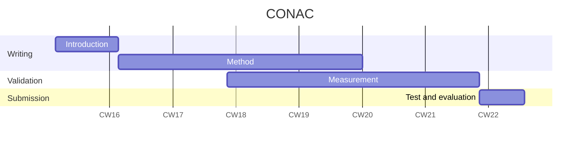

# Constrained Optimization-Based Neuro-Adaptive Control (CONAC)

- Paper Name: TBD
- State: TBD
- Template Version: Robot Branch

> [!Note]
> This paper will be submitted to [IEEE Transactions on Cybernetics](https://ieeexplore.ieee.org/xpl/RecentIssue.jsp?punumber=6221036).

You can find papers here:

- First submission: 
<!-- - Final submission: [still working](./manuscript.pdf) -->

## About this Research

The objective of this research is to design neuro-adaptive controller using constrained optimiztion theory. 
The main features are as follows.

- Stability of controller is ensured in the sense of Lyapunov.
- Weights of neural network and tracking error are bounded over time.
- Constraints are satisfied while adaptation (learning)
    - Weight norm constraint.
    - Control input saturation constraint (which is convex).

## Authors

- [Ryu Myeongseok](https://github.com/DDingR)
- Hong Donghwa
- Choi Kyunghwan

# Gantt Chart

